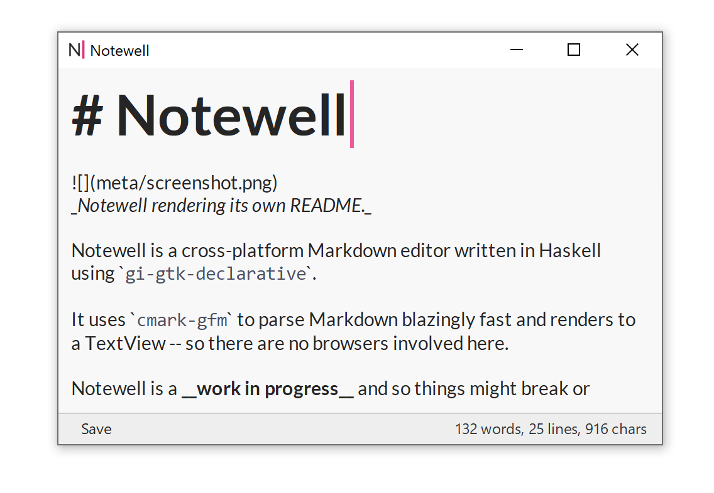
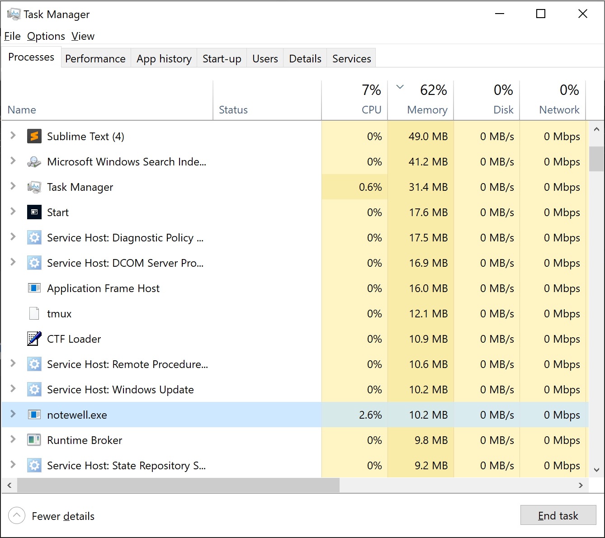
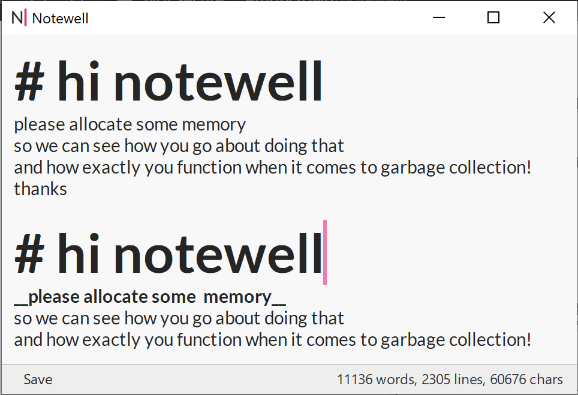
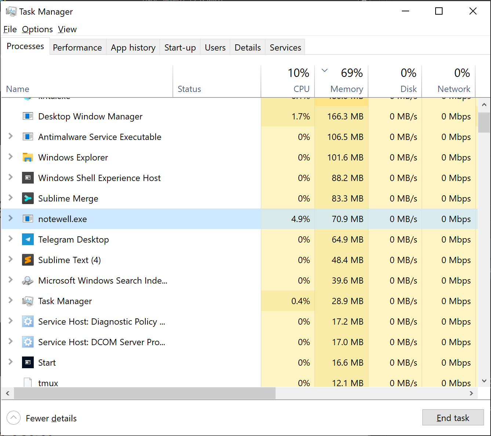

# Notewell 

_Notewell rendering its own README._

Notewell is a cross-platform Markdown editor written in Haskell using `gi-gtk-declarative`.

It uses `cmark-gfm` to parse Markdown blazingly fast and renders to a TextView -- so there are no browsers involved here.

While Notewell has reached 1.0, a state of basic day-to-day usability, it is still very young and far from perfect. 

If you'd like to try it out, you can [build it yourself](https://github.com/ix/notewell/wiki/Build-instructions) or [buy a binary for your platform through the website](http://empty.town/notewell/). 

## Efficiency

Efficiency can be hard to measure, but here are some subjective examples from my personal usage.

On a fresh start on my development machine, Notewell uses only 10MB of memory as of version 1.0 (hopefully this will be improved even further in future!).

When editing a very large file as below, Notewell copes well, being able to shrug the file off and update its Markdown rendering as normal.

